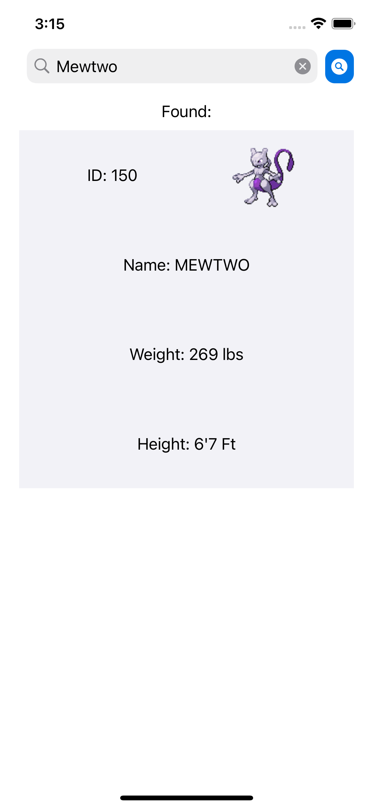

# Pokedex
#### This is a sample app to practice parsing with decodable

A UIKit app that displays Pokemon from the PokeAPI (https://pokeapi.co/)

## Features

- Follows MVC design pattern.
- Custom app icon made in Sketch. 
- No 3rd Party Dependencies

## App Screenshots

 

### Support 
- Built using Xcode 12.4
- Tested on iOS 14.0
